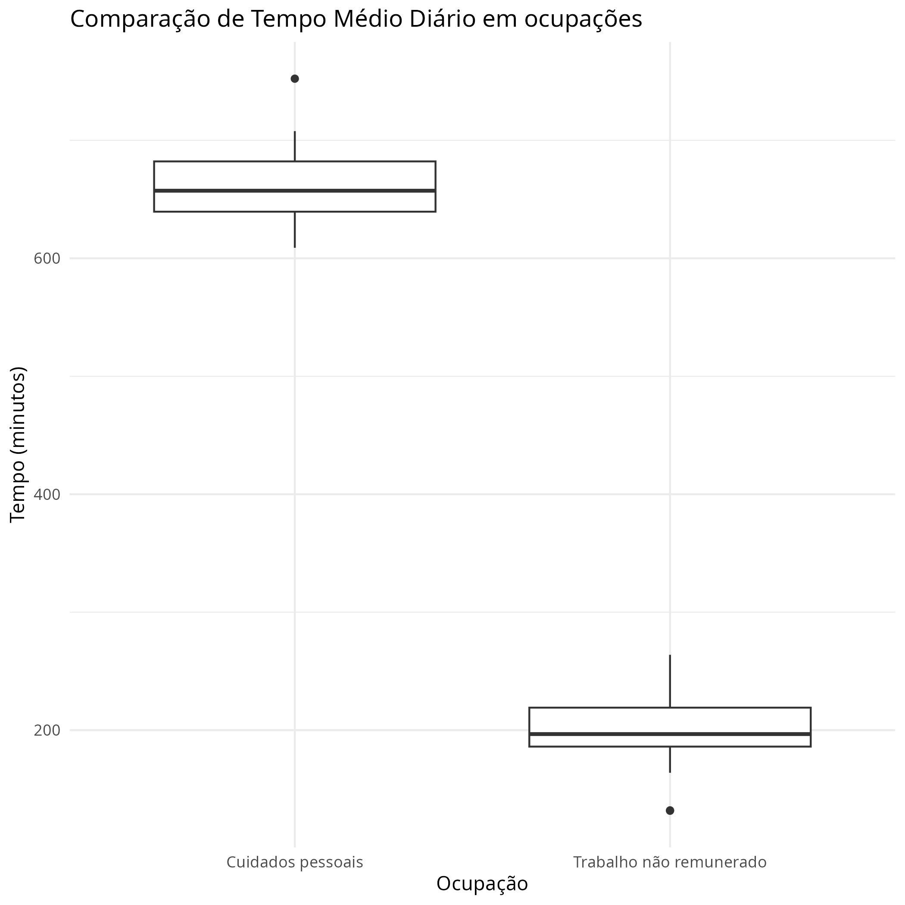

---
output:
  pdf_document
header-includes:
  \usepackage{geometry}
  \geometry{a4paper, left=20mm, right=20mm, top=10mm, bottom=15mm}
---

```{r setup, include=FALSE}
knitr::opts_chunk$set(echo = TRUE, message = FALSE, warning = FALSE)
library(readr)
library(dplyr)
library(ggplot2)
```

```
library(readr)
library(dplyr)
library(ggplot2)


time_use_data <- read_csv("TIME_USE_24092022.csv")

filtered_data <- time_use_data %>%
  filter(País != "África do Sul",
         Ocupação %in% c("Cuidados pessoais", "Trabalho não remunerado"),
         Sexo == "Total")

gg_boxplot <- ggplot(filtered_data, aes(x = Ocupação, y = Tempo)) +
  geom_boxplot() +
  labs(title = "Comparação de Tempo Médio Diário em ocupações",
       x = "Ocupação",
       y = "Tempo (minutos)") +
  theme_minimal()

ggsave("ocupations.png", gg_boxplot)


```

```{r, echo=FALSE, out.width="\\textwidth", out.height="13cm"}

```