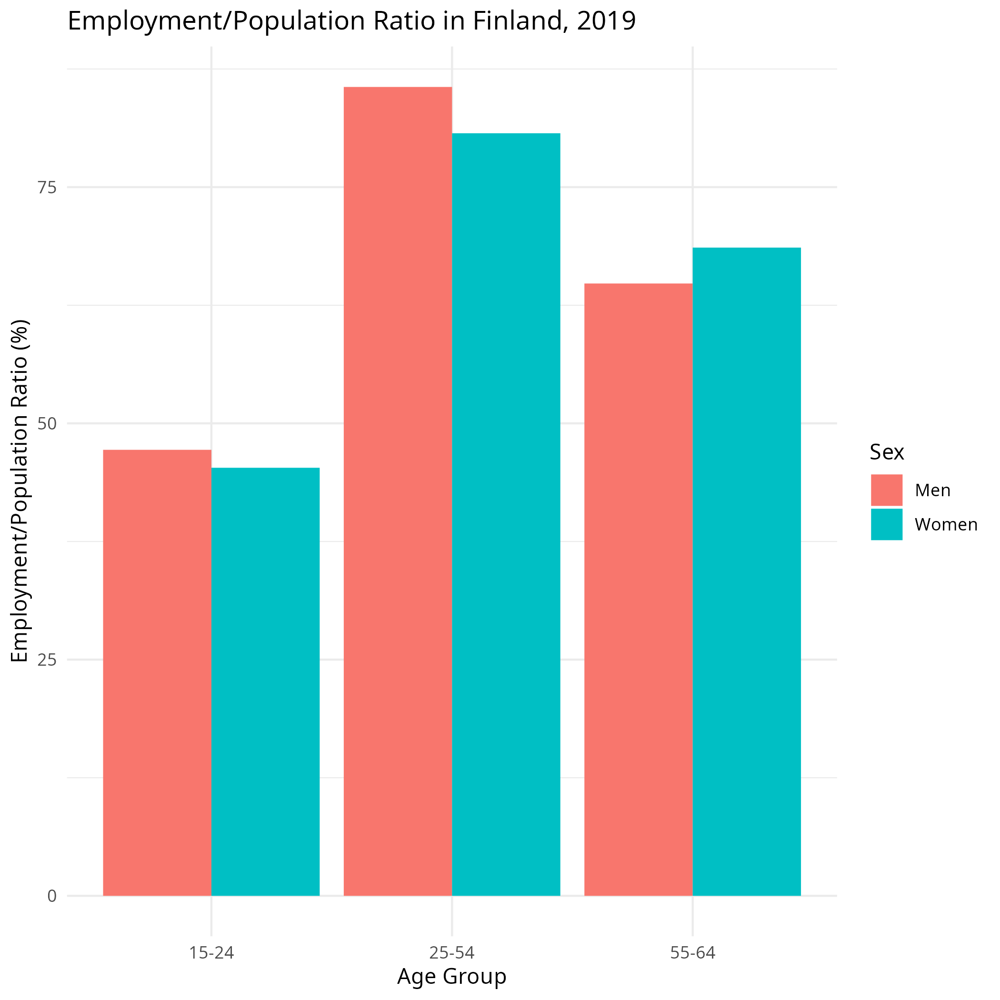

---
output:
  pdf_document
header-includes:
  \usepackage{geometry}
  \geometry{a4paper, left=20mm, right=20mm, top=10mm, bottom=15mm}
---

```{r setup, include=FALSE}
knitr::opts_chunk$set(echo = TRUE, message = FALSE, warning = FALSE)
library(readr)
library(dplyr)
library(ggplot2)
```

```
library(readr)
library(dplyr)
library(ggplot2)

gender_emp_data <- read_delim("GENDER_EMP_19032023152556091.txt", delim = "\t")

filtered_data <- gender_emp_data %>%
  filter(Country == "Finland",
         IND == "EMP2",
         Time == "2019",
         `Age Group` %in% c("15-24", "25-54", "55-64"),
         Sex %in% c("Men", "Women"))

bar_plot <- ggplot(filtered_data, aes(x = `Age Group`, y = Value, fill = Sex)) +
  geom_bar(stat = "identity", position = "dodge") +
  labs(title = "Employment/Population Ratio in Finland, 2019",
       x = "Age Group",
       y = "Employment/Population Ratio (%)",
       fill = "Sex") +
  theme_minimal()

ggsave("data.png", bar_plot)


```

```{r, echo=FALSE, out.width="\\textwidth", out.height="13cm"}

```