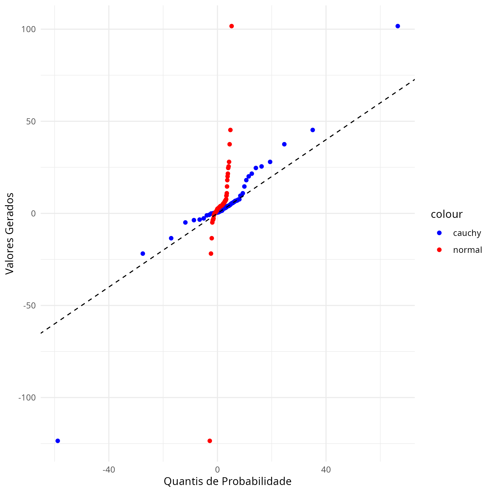

---
output:
  pdf_document
header-includes:
  \usepackage{geometry}
  \geometry{a4paper, left=20mm, right=20mm, top=10mm, bottom=15mm}
---
\scriptsize
```{r setup, include=FALSE}
knitr::opts_chunk$set(echo = TRUE, message = FALSE, warning = FALSE)
library(ggplot2)
```

```
library(ggplot2)

set.seed(1276)

n <- 122
location <- 3.8
scale <- 1.6
mu <- 1.2
sigma <- sqrt(2.8)

# Gerar amostra de distribuição de Cauchy
sample_cauchy <- rcauchy(n, location = location, scale = scale)
sorted_sample <- sort(sample_cauchy)

# Calcular os quantis de probabilidade
probs <- (1:n) / (n + 1)

# Calcular os quantis teóricos da distribuição de Cauchy e da distribuição normal
cauchy_quantiles <- qcauchy(probs, location = location, scale = scale)

normal_quantiles <- qnorm(probs, mean = mu, sd = sigma)


data <- data.frame(
  SortedSample = sorted_sample,
  CauchyQuantiles = cauchy_quantiles,
  NormalQuantiles = normal_quantiles
)


p <- ggplot(data) +
  geom_point(aes(x = CauchyQuantiles, y = SortedSample, color = "cauchy")) +
  geom_point(aes(x = NormalQuantiles, y = SortedSample, color = "normal")) +
  geom_abline(intercept = 0, slope = 1, linetype = "dashed", color = "black") +
  labs(x = "Quantis de Probabilidade", y = "Valores Gerados") +
  scale_color_manual(values = c("cauchy"="blue", "normal"="red")) +
  theme_minimal()


ggsave("quantiles_plot.png", plot = p)


```

```{r, echo=FALSE, out.width="\\textwidth", out.height="13cm"}

```