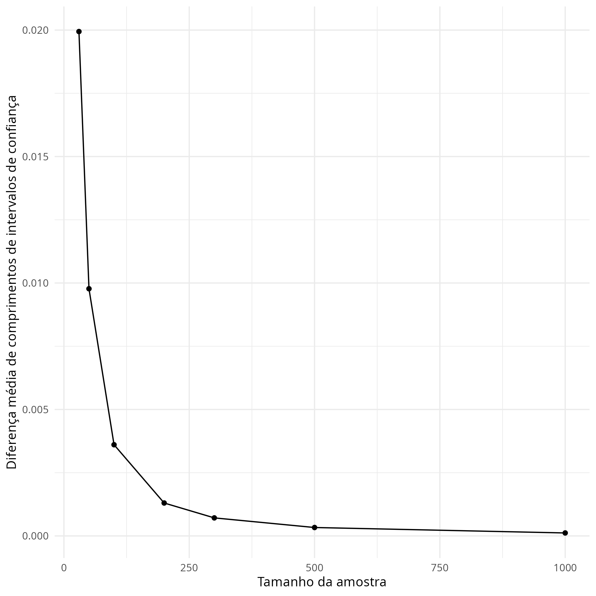

---
output:
  pdf_document
header-includes:
  \usepackage{geometry}
  \geometry{a4paper, left=20mm, right=20mm, top=10mm, bottom=15mm}
---
\scriptsize
```{r setup, include=FALSE}
knitr::opts_chunk$set(echo = TRUE, message = FALSE, warning = FALSE)
library(ggplot2)
```

```
library(ggplot2)
set.seed(1358)
n_values <- c(30,50,100,200,300,500,1000)
k <- 1000
p <- 0.5
gamma <- 0.95
z <- qnorm((1 + gamma) / 2)

method1 <- function(X, n) {
  X_bar <- mean(X)
  c <- 1 + (z^2) / n
  b <- -2 * X_bar - (z^2) / n
  a <- X_bar^2
  roots <- Re(polyroot(c(a, b, c) ))
  interval_length <- abs(diff(roots))
  return(interval_length)
}
method2 <- function(X, n) {
  X_bar <- mean(X)
  std_error <- sqrt(X_bar * (1 - X_bar) / n)
  interval_length <- 2 * z * std_error
  return(interval_length)
}

# Função para a simulação
compare_methods <- function(n, k) {
  diff_lengths <- numeric(k)
  for(i in 1:k) {
    # Gerar amostra de uma distribuição de Bernoulli
    X <- rbinom(n, 1, p)
    
    # Calcular a diferença de comprimento entre os dois métodos
    diff_lengths[i] <- method2(X, n) - method1(X, n)
  }
  return(mean(diff_lengths))
}
results <- sapply(n_values, compare_methods, k)
df <- data.frame(
  n = n_values,
  mean_diff = results
)
plot <- ggplot(df, aes(x=n, y=mean_diff)) +
  geom_point() +
  geom_line() +
  xlab("Tamanho da amostra") +
  ylab("Diferença média de comprimentos de intervalos de confiança") +
  theme_minimal()

ggsave("intervals_diff.png", plot = plot)

```

```{r, echo=FALSE, out.width="\\textwidth", out.height="10cm"}

```

```{r setup2, include=FALSE}
knitr::opts_chunk$set(echo = TRUE)
options(width = 60)
```

Os resultados sugerem que conforme o tamanho da amostra (n) aumenta, a diferença
entre os intervalos de confiança estimados pelos dois métodos diminui. Isto indica que o Método 2, embora menos preciso com amostras menores, torna-se comparável ao Método 1 com amostras maiores. Portanto, em situações com um número suficientemente grande de observações, o Método 2 pode ser confiável. Para tamanhos de amostra menores, o Método 1 pode ser mais preciso. Isso destaca a importância do tamanho da amostra na inferência estatística e a necessidade de escolher o método de cálculo adequado ao tamanho da amostra.
